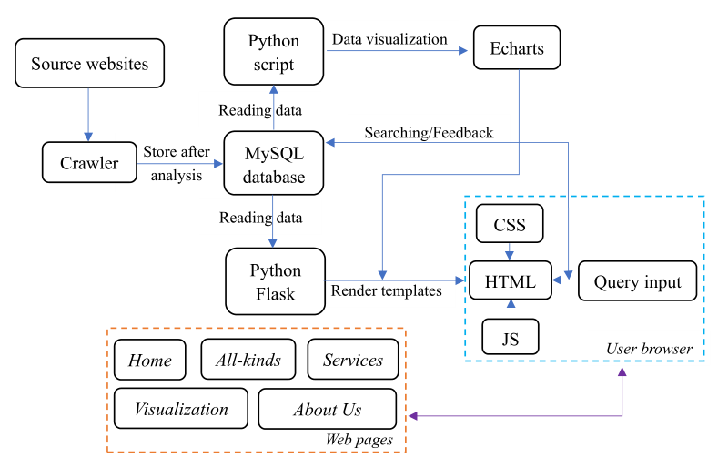
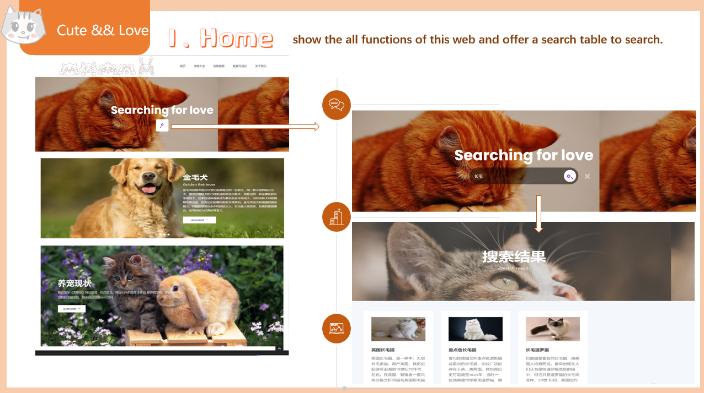
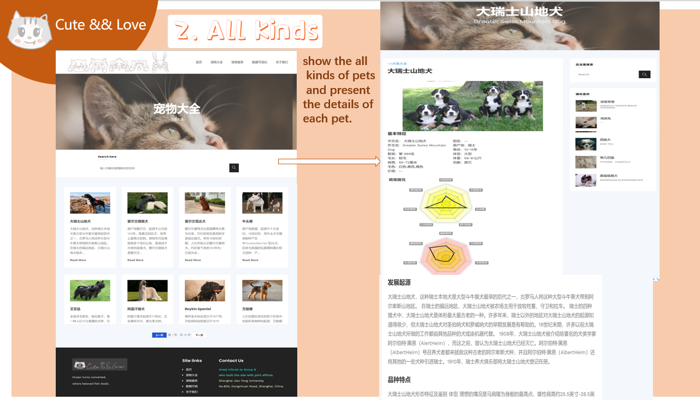
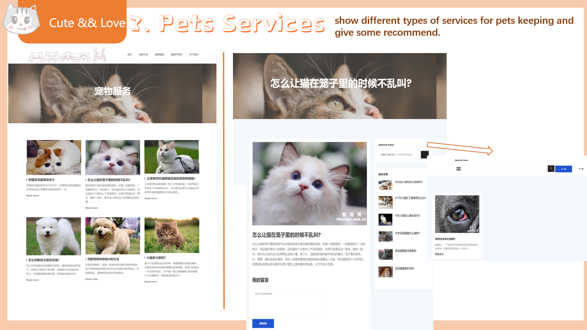
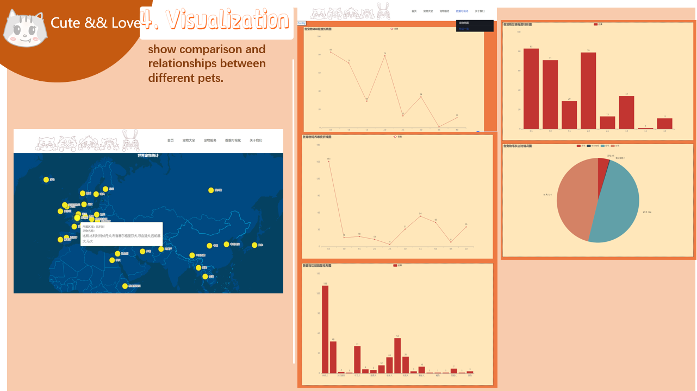
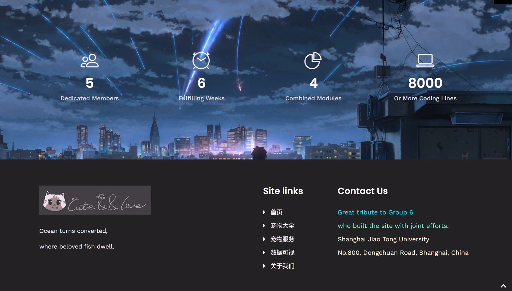

# Pet-website
Course project of SJTU ICE2604: Introduction to Engineering for Electronic Information(Class B), 2021 fall

本项目是电类工程导论（B类）的课程项目。

## 项目主题：
分小组完成，结合**爬虫+数据库、搜索引擎、数据可视化和网页开发**4个模块，完成针对一类数据的爬取、存储、文本检索、可视化、网站呈现等一系列工作，最终完成一个针对一类数据的数据分析与展示的网站平台。

## 核心架构：
The diagram below depicts how this project is arranged and proceeded:

## 成果展示：

